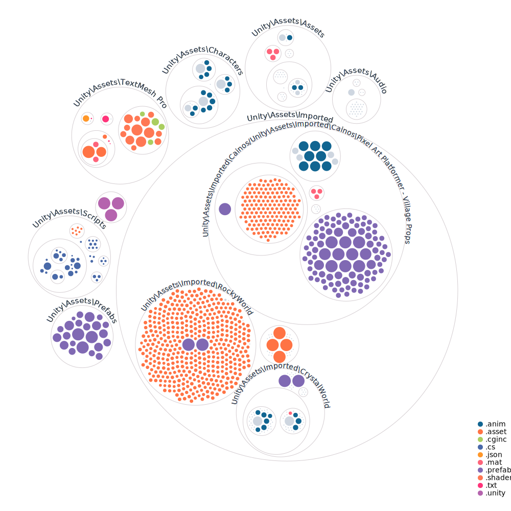

# GAME 395 CRN: 23699

This is a template repository setup by John Shull on behalf of **Mitch Foster**

## Student Project Repository

The most important document in this repository is the PulseCheck.md file, it's located in the [Documentation Folder/PulseChecks/PulseCheck.md](./Documentation/PulseChecks/PulseCheck.md) and has been custom tailored to our first one-on-one meeting. From here on out this repository and this file are maintained between John Shull and **Mitch Foster** - both parties are responsible for the management of this repository and making sure that all items are addressed for the deliverable by the end of the class period.

## Submission Templates

There will be multiple times you will be updating your repository for review and feedback as we are working on this together. The first one will be October 5th. Please see the [FallBreakSub/ProjectProposal.md](./FallBreakSub/ProjectProposal.md) for the template you need to work on towards submission.

## Notes

Feel free to update and use this readme in any format as you see fit. As you complete items that are to align with your grading agreement update the documentation and provide support/reference to those completion status. This is an ever-evolving process and I greatly appreciate your time in working with me on getting this operational!

## Project Visualization

Generated via a [GitHubNext Project](https://github.com/githubocto/repo-visualizer) using GitHub Actions!

